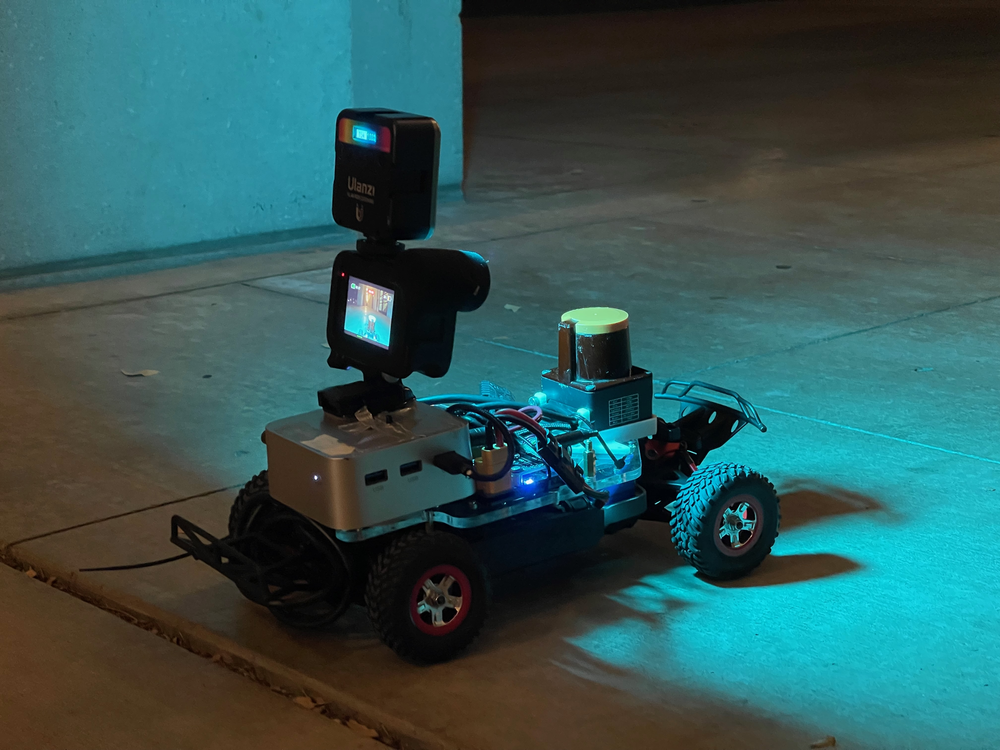
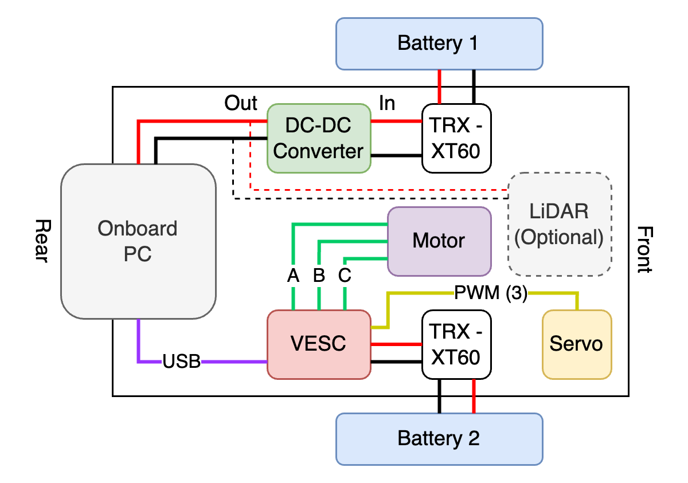

# Build Your Own Cars

## F1/10

Feel free to build with the [official F1TENTH documentation](https://f1tenth.org/build.html).

## F1/16

Our custom 1/16 car roughly follows the same build process as a F1/10 car, but in a more compact form factor to fit into tighter research spaces.

### Sourcing Parts

These are publicly available parts. In case the exact hardware is not sold in your region, you can follow the description to source similar hardwares.

| Name                                                                                                                                                           | Quantity | Note                                                                                                                            |
|----------------------------------------------------------------------------------------------------------------------------------------------------------------|----------|---------------------------------------------------------------------------------------------------------------------------------|
| [VESC 6 EDU w/ IMU](https://trampaboards.com/vesc-six-education--with-imu-p-34332.html)                                                                        | 1        | Compact VESC controller.                                                                                                        |
| [Mini PC](https://a.co/d/7H0WKfA)                                                                                                                              | 1        | Onboard compute. No GPU necessary. x86 or ARM.                                                                                  |
| [1/16 Chassis](https://traxxas.com/products/models/electric/70054-8-slash-116)                                                                                 | 1        | Traxxas RC car chassis to be modified.                                                                                          |
| [Strengthened Shocks](https://a.co/d/hQYlhKF)                                                                                                                  | 1        | We highly recommend to use the springs in these shocks to replace the original ones, which do not hold the new car weight well. |
| [HOBBYWING XeRun 3652 G2 BLDC Motor (3800 kv)](https://www.hobbywingdirect.com/collections/hw-brushless-motor/products/xerun-3652sd-motor?variant=28086278801) | 1        | BLDC motor that supports 2S battery and fits into the Traxxas mounting design (25.4 mm diameter M3 holes).                      |
| [2S LiPo Battery](https://traxxas.com/products/parts/batteries/idpowercellbatteries/lipo/2820X-2200mah-74v-2S-25C)                                             | 2        | Note the dimension of the battery to fit into the compartment.                                                                  |
| [TRX to XT60 Adapter](https://a.co/d/btrpB0N)                                                                                                                  | 2        | Converts TRX battery lead to XT60. One for each battery. We recommend ones with wires in the middle.                            |
| [DC-DC Converter](https://a.co/d/9CXdR46)                                                                                                                      | 1        | Boost the battery voltage to PC's voltage (12V).                                                                                |
| [Micro USB to USB A cable](https://a.co/d/8QPIe7X)                                                                                                             | 1        | Connect VESC and PC. Short right-angled ones look neat.                                                                         |
| [DC Barrel Jack](https://a.co/d/egUG5Ny)                                                                                                                       | 1        | Powers PC from DC-DC converter.                                                                                                 |
| Assorted 12 AWG Wires                                                                                                                                          | -        | For wiring needs.                                                                                                               |
| Assorted Screws and Nuts                                                                                                                                       | -        | For getting stuffs together (M3, M4).                                                                                           |
| [Standoffs](https://a.co/d/hqiwtzX)                                                                                                                            | 1        | Standoffs of various sizes (M3, M4).                                                                                            |
| [HDMI Dummy](https://a.co/d/0B0I2hi) (optional)                                                                                                                | 1        | Create display for remote desktop software (NoMachine).                                                                         |
| [Hokuyo UST-10LX LiDAR](https://hokuyo-usa.com/products/lidar-obstacle-detection/ust-10lx) (optional)                                                          | 1        | 2D LiDAR SLAM.                                                                                                                  |
| [ZED Mini](https://www.stereolabs.com/store/products/zed-mini) (optional)                                                                                      | 1        | VIO & visual SLAM.                                                                                                              |

### Custom Parts

- `3dprints/`

1. F1-16th Low Friction Plastic Wheels (optional)
2. Hokuyo Lidar Mount (optional)
3. Zed Mini Mount (optional)
4. Mini-PC Mount
5. Jetson Orin NX Mount

- `laser_cuts/`

1. Carrier board to be cut with 1/4 inch acrylic.

### Electrical Wiring

Battery 1 powers the delicate electronics, whereas battery 2 powers the low-level actuators. An optional LiDAR can be powered from battery 1.